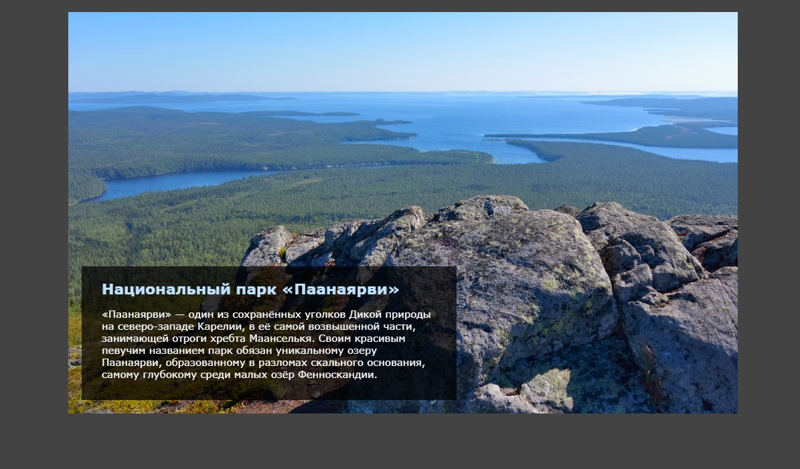

# Slider with a changing background
___

The slider is made without the use of scripts using CSS-sabotage [animation](https://developer.mozilla.org/ru/docs/web/css/animation).
The often used structure in the form of a slider for buckshot and a preview with a dynamic background.

Information about the code:
For the show of each slider, 10 seconds are allocated, and there are 4 of them. Therefore, the total duration of animation is 40 seconds. This is indicated in the lines of Animation: Slideanim 40s Infinite and Animation: Zoom 40s Infinite

For each slide, a delay is separately installed, these are. Slideshow -ite: NTH-Child (1), .SlidesHow -item: NTH-Child (1) IMG, etc.

The values in the Slideanim animation are set as follows:

12.5% {OPACITY: 1} - 100 /4 (number of slides) / 2, in which we move from complete transparency to the visible area
25% {opace: 1} - 100 /4 (number of slides), in which we show an opaque slide
37.5% {Opages: 0} - Fold the first two values for the transition again to transparency.

The values in the animation of Zoom are set as follows:

50% {transform: scale (1.3)} - 100 /4 (number of slides) x 2, in which we increase the photo.

# Слайдер с меняющимся фоном
___

Слайдер выполнен без применения скриптов с использованием СSS-свойства [animation](https://developer.mozilla.org/ru/docs/Web/CSS/animation).
Часто используемая структура в виде слайдера для картачек и превью с динамическим фоновым.

Информация о коде:
На показ каждого слайдера выделяется 10 секунд, а всего их 4. Поэтому общая продолжительность анимации составляет 40 секунд. Это указывается в строках animation: slideanim 40s infinite и animation: zoom 40s infinite

Для каждого слайда отдельно устанавливается задержка, это классы .slideshow-item:nth-child(1), .slideshow-item:nth-child(1) img и т.д.

Значения в анимации slideanim устанавливаются так:

12.5% {opacity: 1} - 100 / 4 (кол-во слайдов) / 2, при котором переходим с полной прозрачности в видимую область
25% {opacity: 1} - 100 / 4 (кол-во слайдов), при котором показываем непрозрачный слайд
37.5% {opacity: 0} - складываем первые два значения для перехода опять в прозрачность.

Значения в анимации zoom устанавливаются так:

50% {transform: scale(1.3)} - 100 / 4 (кол-во слайдов) x 2, при котором увеличиваем фотографию.