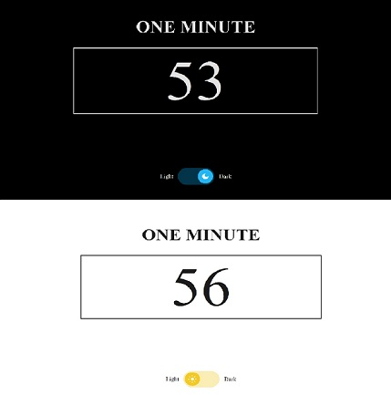

#Timer and Light/Dark Background Switcher
___

The abstract task is implemented in pure SCC using [variables](https://developer.mozilla.org/en-US/docs/Web/CSS/Using_CSS_custom_properties) and rules [@keyframes](https://developer.mozilla.org/en-US/docs/Web/CSS/@keyframes), @property and feature queries - @supports. The CSS code structure is split into two blocks (Timer and Light/Dark Toggle).

#Таймер и Переключатель фона «Светлый/Темный»
___
Абстрактная задача реализована на чистом SCC с помощью [переменных](https://developer.mozilla.org/ru/docs/Web/CSS/Using_CSS_custom_properties) и правил [@keyframes](https://developer.mozilla.org/en-US/docs/Web/CSS/@keyframes), [@property](https://developer.mozilla.org/en-US/docs/Web/CSS/@property) и проверки feature queries - [@supports](https://developer.mozilla.org/en-US/docs/Web/CSS/@supports). Структура кода CSS разбита на два блока (Timer и Light/Dark Toggle).

